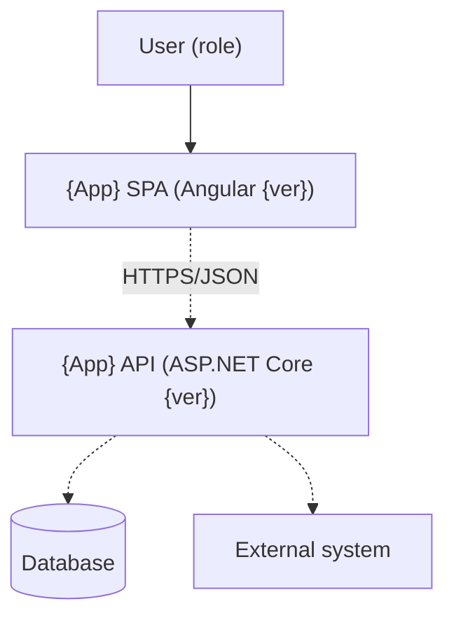
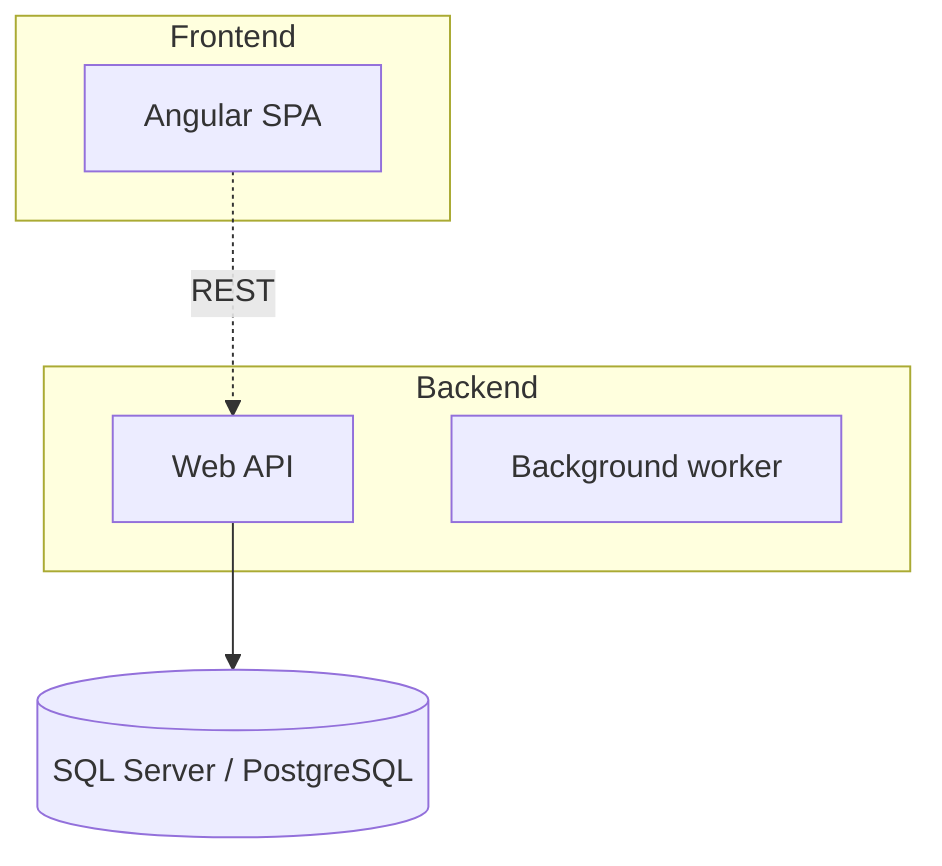

# {System name} — Architecture Overview

> Generated from source analysis on {date}. Sections marked ⚠ are inferred.

## 1. System Context (C4 L1)

{One paragraph: what the system does, who uses it, what it talks to.}

## 2. Containers (C4 L2)

| Container | Technology | Responsibility | Source |
|---|---|---|---|
| {SPA} | Angular {ver} | {…} | `src/{...}` |
| {API} | .NET {ver} | {…} | `src/{...}` |

## 3. Key components (C4 L3) — {selected container}

{Only for containers the user asked about. Component = project/module/feature
folder, not individual classes.}

## 4. Cross-cutting concerns

- **Auth:** {…}
- **Error handling:** {…}
- **Configuration:** {…}
- **Observability:** {…}
