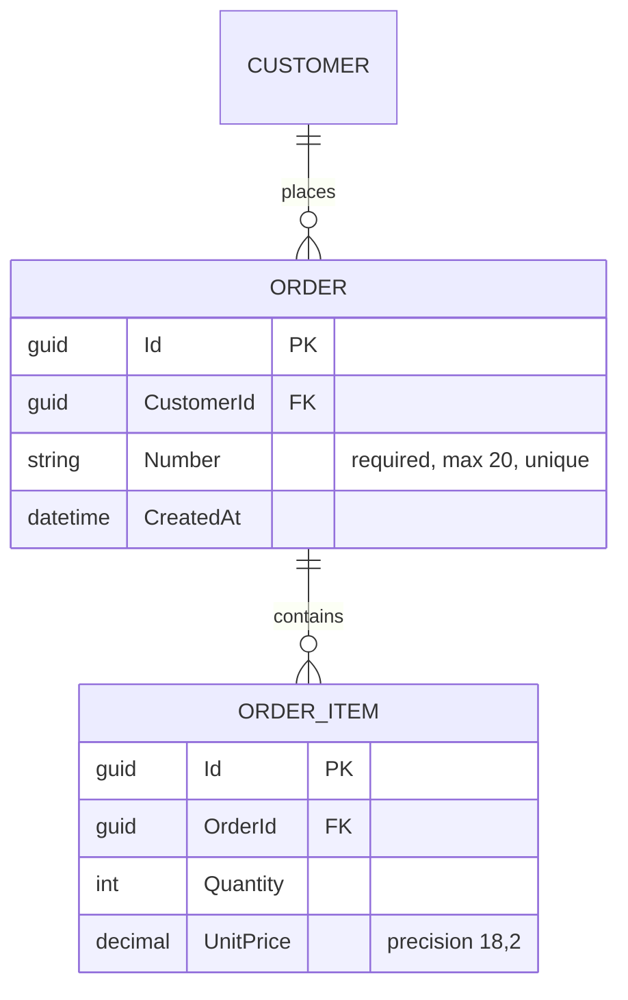

# {System name} — Data model

> Source: `{path/to/AppDbContext.cs}` · Provider: {SQL Server | PostgreSQL | …}
> · Generated {YYYY-MM-DD}. Facts marked ⚠ Convention are EF defaults, not
> explicit configuration.

{One paragraph: what the model covers, how many entities, and the split
into bounded contexts if any.}

## ER diagram

## Entities

### {Entity}

Table: `{schema}.{Table}` · Config: `{path/to/EntityConfiguration.cs}`

| Column | Type | Constraints | Notes |
|---|---|---|---|
| Id | uniqueidentifier | PK | |
| {…} | | | |

**Relationships**

| Related entity | Cardinality | FK | On delete |
|---|---|---|---|
| {…} | one-to-many | `{FkColumn}` | Cascade |

## Migration history

| Migration | Date | Schema impact |
|---|---|---|
| `{20240101000000_Initial}` | {YYYY-MM-DD} | {Creates Orders, OrderItems} |
